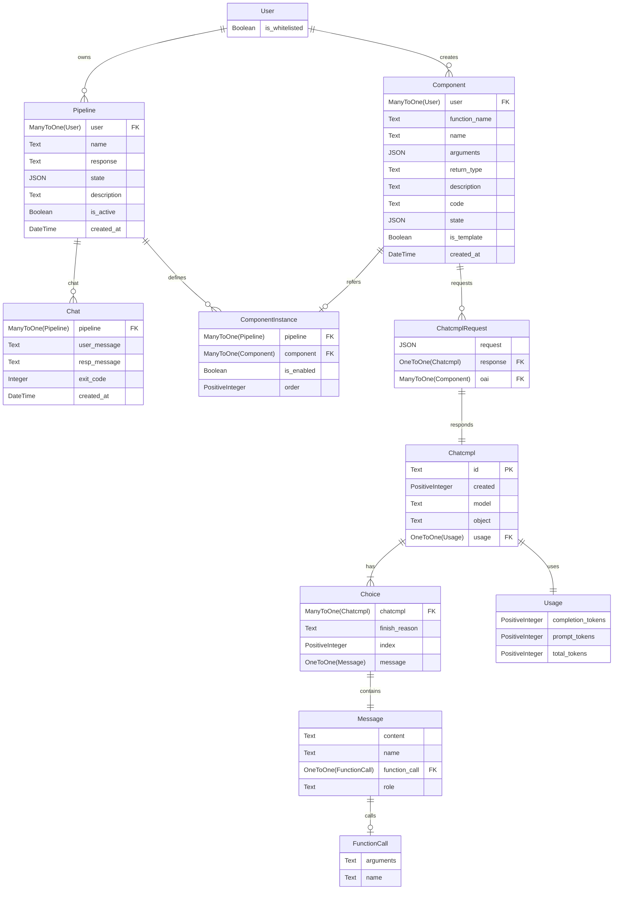

# Chat Composer

Chat composer project.

## Graphs

### ER Diagram


## Environment Setup

### Python

We use Python 3.11, so make sure you have that installed.

You could use [pyenv](https://github.com/pyenv/pyenv) or [pyenv-win](https://github.com/pyenv-win/pyenv-win) (Windows is not recommended to install pyenv because it does not get native support) to manage your Python versions.

Install the Python version you want to use.
```bash
pyenv install 3.11
```

Specify the version for this directory.
```bash
pyenv local 3.11
```

To check your Python version, run `python --version` in your terminal.
```bash
python --version
```
Or you may need to specify the version explicitly if you didn't use pyenv or have multiple versions installed.
```bash
python3 --version
```

### Virtual Environment

It is recommended to use a virtual environment to manage dependencies.

It is highly recommended to use the [venv](https://docs.python.org/3/library/venv.html) module that comes with Python.

To create a virtual environment in the `.venv` directory, run:
```bash
python -m venv .venv
```

Activate the environment.
```bash
# Linux, Bash, Mac OS X
source .venv/bin/activate
# Linux, Fish
source .venv/bin/activate.fish
# Linux, Csh
source .venv/bin/activate.csh
# Linux, PowerShell Core
.venv/bin/Activate.ps1
# Windows, cmd.exe
.venv\Scripts\activate.bat
# Windows, PowerShell
.venv\Scripts\Activate.ps1
```

Install the dependencies.
```bash
pip install -r requirements.txt
```

When you want to deactivate the virtual environment.
```bash
deactivate
```

### Environment Variables

Make a copy of the `.env.example` file and rename it to `.env`.
```bash
cp .env.example .env
```

Fill in the environment variables in the `.env` file.

## Running the Project

There are 2 ways to run the project, using Docker, or using the database + Django locally.

The production environment is deployed using Docker. However, you can also use the database + Django locally for development because it is the same build as the production environment.

### Docker

You can skip the database and Django setup if you use [Docker](https://www.docker.com).

You have to make sure the environment variables in the `.env` file are set correctly, the port is set to 5433 in `docker-compose.yml` file to avoid conflict with the local database.
```bash
# Windows
DB_HOST = host.docker.internal
DB_PORT = 5433
# Linux, Mac OS X
DB_HOST = 127.17.0.1    # or any IP address you set explicitly
DB_PORT = 5433
```

Make sure you have Docker installed.
```bash
docker --version
```

Also make sure you have [Docker Compose](https://docs.docker.com/compose) installed.
```bash
docker-compose --version
```

Run and build the images.
```bash
docker-compose up
```

Despite `chat-composer-web-1` says server is at http://0.0.0.0:8000/, you should use http://localhost:8001/ defined in the `docker-compose.yml` file.

When you want to stop the containers.
```bash
docker-compose down
```

### Database + Django

Use [PostgreSQL](https://www.postgresql.org) as the database.

You have to make sure the environment variables in the `.env` file are set correctly.
```bash
DB_HOST = localhost
DB_PORT = 5432          # default postgresql port
```

Run the Django migrations.
```bash
python manage.py makemigrations
python manage.py migrate
```

Create a superuser.
```bash
python manage.py createsuperuser
```

Run the server.
```bash
python manage.py runserver
```

## Code Style Enforcement

### Lint and Pre-commit

We use [Flake8](https://flake8.pycqa.org) and [ISort](https://pycqa.github.io/isort/) for the coding style and guidelines. The style is then enforced by [pre-commit](https://pre-commit.com).

Finish the environment setup above (especially installing the dependencies with pip) before using pre-commit.

Install and setup pre-commit.
```bash
pre-commit install
```

To run pre-commit manually (only scans staged files).
```bash
pre-commit run --all-files
```

Remember to stage files again if there are any changes made by the pre-commit hooks or by you.
```bash
git add .
```

### VS Code Settings

You can add a workspace setting to automatically format your code on save using the black formatter.

You need to have the [Black Formatter](https://marketplace.visualstudio.com/items?itemName=ms-python.black-formatter) VS Code extension installed.

Bring up the command palette with Ctrl+Shift+P(Windows/Linux) / Cmd+Shift+P(Mac) and search for "Preferences: Open Workspace Settings (JSON)".

Then replace the content with the following:
```json
{
    "editor.formatOnSave": true,
    "[python]": {
        "editor.defaultFormatter": "ms-python.black-formatter",
    },
    "black-formatter.args": [
        "--line-length",
        "79",
        "--experimental-string-processing"
    ],
}
```

## Development

### Clone Repository

First clone the repository.
```bash
git clone git@github.com:lioqing/chat_composer.git
```

**Important**: You may need to setup SSH keys for your GitHub account. See [this guide](https://help.github.com/en/github/authenticating-to-github/connecting-to-github-with-ssh) for more information.

### Checkout Branch

Then checkout the branch you want to work on.
```bash
git checkout <branch>
```

### Committing Changes

Commit your changes to the branch you are working on.
```bash
git add .
git commit -m "Your commit message"
```

Make any changes and stage your files again according to the pre-commit hooks.

### Pushing Changes

Set your branch's upstream branch to be the same branch on the remote repository on GitHub.
```bash
git push -u origin <branch>
```

After the first time you set the upstream branch, you can simply push without specifying the branch.
```bash
git push
```
